# Mail Cleaner

**Sort and label your email with simple rules. Everything is filed, nothing is deleted.**

   

<p align="center">
  
</p>

Mail Cleaner organizes your mailbox. You write simple rules (or let Claude write them), and it **labels and files** matching emails into the right label or folder, such as promotions, login codes, automatic notifications, big attachments and old mail you've already read.

It works with [Claude Code](https://claude.com/claude-code), an AI assistant you chat with in your terminal. You say what you want, like *"sort my old promotions"*, and Claude follows the rule files to find the emails, show them to you, and file them once you say yes.

```text
You:     run rule dump4-otp on gmail-test
Claude:  dump4-otp -> Dump4_OTP: 1 match
           2026-08-19  Bank Security  "Your verification code is 482913"
         Move 1 message to Dump4_OTP? (yes / skip / stop)
You:     yes
Claude:  Moved 1 message. To reverse: undo run 20261003-185355-apply
```

## Example rules

A *rule* is a short text file in `rules/` that says which emails to find and where to put them. Five examples come with the project. Keep them, change them, or delete them and write your own. Each one shows a different kind of condition:

| Example | Finds | Files it as | Shows how to |
|---|---|---|---|
| `dump1-big-files` | emails over 5 MB | `Dump1` | match by **size** |
| `dump2-promos` | promotions or "unsubscribe" emails, older than 2 years | `Dump2_Promos` | match by **age** and use "this **or** that" |
| `dump3-automated` | `noreply@`, `no-reply@`, `notifications@` or `alerts@` senders, older than 6 months | `Dump3_Automated` | match **sender patterns** |
| `dump4-otp` | verification codes and one-time passwords, older than 30 days | `Dump4_OTP` | match words in the **subject** |
| `archive-old` | emails you read but never replied to, older than 3 years | `Archive_Old` | combine **read** and **replied** |

Open any of them to see how it is built. They are about ten lines each. Your own rules go in the same folder, and [Write your own rule](#write-your-own-rule) below shows how.

When two rules match the same email, the first one wins. A rule that finds nothing does nothing.

**Labels or folders?** Gmail uses labels, so the email gets the new label and leaves the inbox. It stays in All Mail and you can find it by the label. Outlook and Yahoo use folders, so the email moves into a new folder. The label or folder is created for you if it doesn't exist.

## Safe by design

- **It never deletes.** It only labels and moves. It never touches Trash, Spam or Junk, and it never sends mail.
- **You see it first.** Every rule shows how many emails match, plus a sample, and asks before it moves anything. This preview is called a *dry run*.
- **Some emails are always skipped:** starred or flagged ones, important ones, and any sender in `config/keep-senders.md`, your *keep list*.
- **Undo works.** Each run saves a log in `logs/`. Say `undo run <id>` and everything goes back to the inbox.
- **Your own mailbox is locked by default.** An account marked `real` does nothing until you set `live: yes` yourself.
- **Passwords stay private.** They live in a file called `.env`, which is never uploaded to GitHub.

## What you need

- [Claude Code](https://claude.com/claude-code)
- [uv](https://docs.astral.sh/uv/), which runs the project's Python code (`brew install uv` on a Mac)
- [Node.js](https://nodejs.org) 20 or newer, used for the Outlook connection
- [Git](https://git-scm.com)
- A Gmail, Outlook, Hotmail or Yahoo account. **Start with a free throwaway account** while you learn.

## Quick start

**1. Download and check it**

```bash
git clone https://github.com/Vedmeena21/Email-cleaner.git
cd Email-cleaner
cp .env.example .env
uv run pytest
```

You should see `75 passed`.

**2. Add your account**

Open `config/accounts.md` and edit one row:

```text
| gmail-test | gmail | you@gmail.com | test | yes | no |
```

The columns are: a name you choose (`id`), the provider (`gmail`, `microsoft` or `yahoo`), your address, `test` or `real`, `enabled` set to `yes`, and `live` set to `no`.

**3. Connect your email** (pick your provider below)

**4. Start Claude Code**

```bash
claude
```

Claude Code reads this project's settings on start. If it asks you to trust the project's tools, say yes. Type `/mcp` to see them connected. (*MCP* is the standard way Claude plugs into other apps.)

## Connect your email

### Gmail

1. In the [Google Cloud Console](https://console.cloud.google.com/), create a project and enable the **Gmail API**.
2. Open **Google Auth Platform**, choose **External**, and add your Gmail address under **Audience > Test users**.
3. Under **Clients**, create a client of type **Desktop app**. Copy the Client ID and Client secret into `.env`:
   ```text
   GOOGLE_OAUTH_CLIENT_ID=your-client-id
   GOOGLE_OAUTH_CLIENT_SECRET=your-client-secret
   ```
4. The first time Claude uses Gmail, a browser window opens. Sign in and click **Allow**. If Google says the app isn't verified, choose **Advanced > Go to mail-cleaner**. That is normal for an app you made yourself.

### Outlook and Hotmail

These two use the same Microsoft sign-in and need no keys. Run:

```bash
MS365_MCP_TENANT_ID=consumers npx -y @softeria/ms-365-mcp-server@0.158.0 --login
```

It prints a code. Enter it at <https://microsoft.com/devicelogin> and sign in.

### Yahoo

1. In Yahoo, open **Account Security > External connections > Create app password**. An *app password* is a one-off password for a single app.
2. Add it to `.env`. The name is `MC_`, your account `id` in capitals with `-` changed to `_`, then `_APP_PASSWORD`:
   ```text
   MC_YAHOO_TEST_APP_PASSWORD=your-app-password
   ```

More detail for every provider, including how to make throwaway accounts, is in [tests/accounts-setup.md](tests/accounts-setup.md).

## Using it

Type these into Claude Code:

| Say | What happens |
|---|---|
| `dry run all rules on gmail-test` | shows what would move, changes nothing |
| `run my cleanup` | previews each rule, asks, then labels and files the emails |
| `run rule dump1 on gmail-test` | runs one rule on one account |
| `undo run <run id>` | moves everything from that run back |
| `add a rule` | asks a few questions and writes a new rule file |

Start with the dry run. When the preview looks right, run it and answer `yes`, `skip` or `stop` for each rule.

## Write your own rule

A rule has three parts: a **name**, a **target** (the label or folder to file into), and the **conditions** an email must meet.

**The easy way:** tell Claude `add a rule`. It asks a few questions, writes the file and checks it for you.

**By hand:**

1. Copy `rules/_TEMPLATE.md` to a new file, for example `rules/receipts.md`.
2. Fill it in. This rule files old shop receipts:

   ```markdown
   ---
   name: receipts                  # same as the file name
   description: Old shop receipts
   target: Receipts                # the label or folder to file them into
   conditions:                     # every line must match
     older_than: 1y
     from: ["@shop.example"]
     subject: [receipt, invoice]
   ---
   Receipts I want out of the inbox but still easy to find.
   ```

3. Check it: `uv run tools/validate_rules.py`
4. Try it with a dry run: `dry run rule receipts on gmail-test`

You can use these conditions, alone or together:

| Condition | Example | Matches |
|---|---|---|
| `older_than` | `2y`, `6m`, `30d` | emails older than this |
| `larger_than` | `5MB` | emails bigger than this |
| `from` | `["noreply@*"]` | senders that fit these patterns |
| `subject` | `["login code"]` | these words in the subject |
| `contains` | `["unsubscribe"]` | these words anywhere in the email |
| `category` | `promotions` | Gmail's category (Gmail only) |
| `is_read` | `true` | read or unread emails |
| `replied` | `false` | emails you did or didn't reply to |
| `any_of` | a list of groups | at least one group matches |

To skip certain emails, add `exclusions:` with the same conditions. For example, `exclusions: { from: ["boss@work.example"] }` keeps that sender out of the rule.

## What's in the project

```text
rules/       one file per rule
providers/   how Gmail, Outlook and Yahoo each run a rule
config/      your accounts, keep list and settings
logs/        the undo log from each run
servers/     the code that connects Claude to your mail
tools/       checks that a rule file is valid
tests/       automatic tests and a throwaway-account test kit
.claude/     Claude's cleanup skills and the safety check
docs/        why these connections were chosen
```

## Contributing

New rules and providers are welcome. See [CONTRIBUTING.md](CONTRIBUTING.md). For the reasons behind each connection, see [docs/provider-research.md](docs/provider-research.md).

## Credits

The Yahoo connection builds on [darcodev/email-cleaner](https://github.com/darcodev/email-cleaner) (MIT). See `servers/mailcleaner/THIRD_PARTY.md`.
